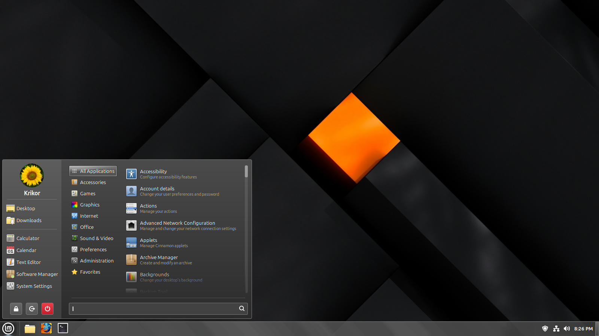

Note: The following theme only work for the Cinnamon desktop environment.
-
Credits to: https://github.com/B00merang-Project/Windows-7 (for the PNG assets and some CSS code)

How to install?
-
Download the themes folder, extract it to the themes directory i.e. /home/USERNAME/.themes and apply in themes settings.

/* Test Update */
